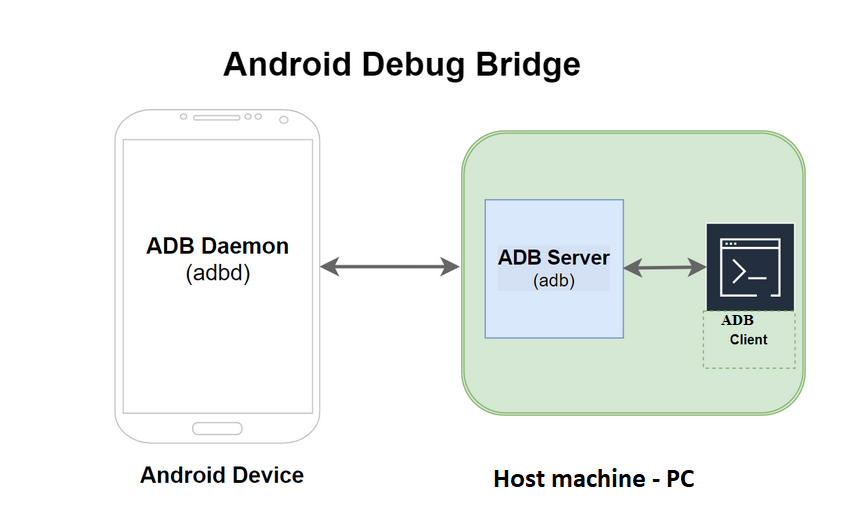
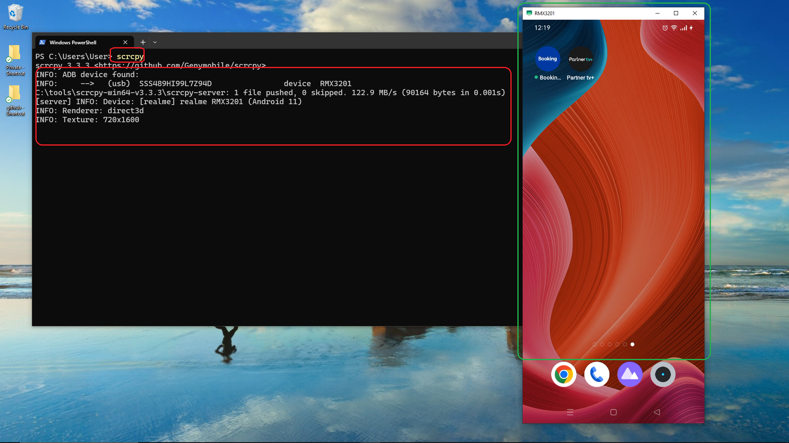
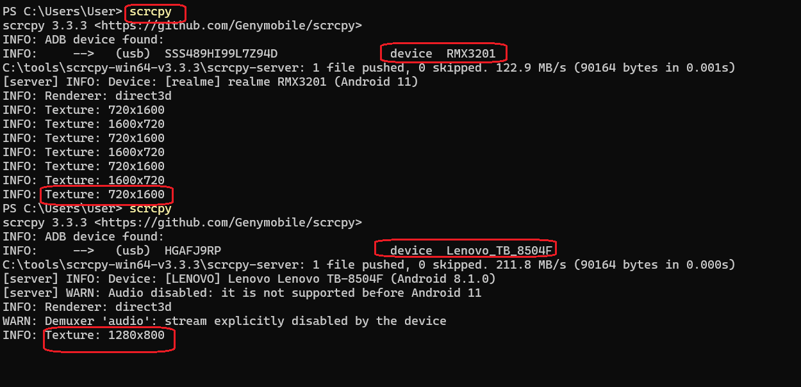
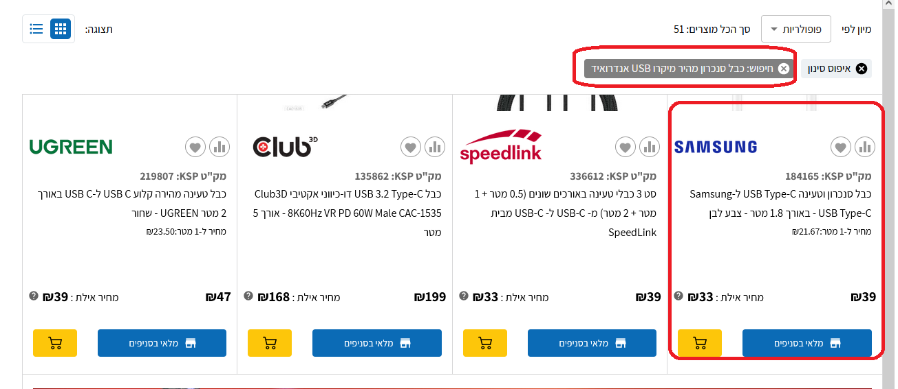

<h1>Project Name</h1>
....

<h2>Project Description</h2>
....

<h2>Motivation</h2>
I want to watch partner tv on my new 27 inch pc so how to do it.

<h2>Current setup</h2>
<ul>
<li>partner has android app and can be watched on tv</li>
<li>i want to watch basketball game via partner on pc</li>
<li>partner no longer support web view</li>
<li>my pc is connected via router it is not connected to the tv</li>
<li>my pc run windows 10 i might be willing to upgrade to windows 11</li>
<li><strong>Pc setup</strong></li>
    <ul>
        <li>Device Name: DESKTOP-P36PBLU</li>
        <li>Processor: 12th Gen Intel(R) Core(TM) i3-12100F @ 3.30 GHz</li>
        <li>Installed RAM: 16.0 GB (15.9 GB usable)</li>
        <li>Storage: <ul>
            <li>238 GB SSD (Lexar SSD NM620 256GB)</li>
            <li>298 GB HDD (Hitachi HDS721032CLA362)</li>
        </ul></li>
        <li>Graphics Card: NVIDIA GeForce GT 710 (2 GB)</li>
        <li>Device ID: 4762E43E-8FC6-4AE0-B63A-600A5FF38D72</li>
        <li>Product ID: 00326-00782-09570-AAOEM</li>
        <li>System Type: 64-bit operating system, x64-based processor</li>
        <li>Pen and touch: No pen or touch input is available for this display</li>
    </ul>
<li><strong>Windows 10 Details:</strong></li>
<ul>
    <li>Edition: Windows 10 Home</li>
    <li>Version: 22H2</li>
    <li>Installed on: 09/03/2021</li>
    <li>OS Build: 19045.6456</li>
</ul>
<li>My Mobile phone</li>
<ul>
<li>The Realme C21</li>
<li>uses a Micro-USB charging port and is designed for 10W (5V/2A) charging.</li>
</ul>
<li>Sarit tablet</li>
<ul>
<li></li>
</ul>
</ul>

<h2>Key Takeaways</h2>
<ul>
  <li>
    <strong>Usage:</strong> Enable <em>USB debugging</em> on your Android phone, connect it to the PC with a data cable, and run <code>scrcpy</code> — your phone’s screen will appear live on the PC.
  </li>
</ul>

<h2>Installation</h2>

<h3>1. Enable Developer Options & USB Debugging (on Realme C21)</h3>
<ol>
  <li>Open <strong>Settings &gt; About phone</strong>.</li>
  <li>Find <strong>Build number</strong> (or Software version) and tap it 7 times until you see “You are now a developer”.</li>
  <li>Return to <strong>Settings &gt; System &gt; Developer options</strong> (or search “Developer options”).</li>
  <li>Enable <strong>USB debugging</strong>.
    
If prompted when connecting later, accept the computer’s RSA key on the phone (check “Always allow from this computer”).

  </li>
</ol>

<h3>2. Install Scrcpy (Windows)</h3>
<ol>
  <li>Download the <a href="https://github.com/Genymobile/scrcpy/releases" target="_blank">Scrcpy Windows ZIP</a> and extract it to a folder, e.g. <code>C:\tools\scrcpy</code>.</li>
  <li>Connect your phone via USB cable (use a data cable, not charge-only).</li>
  <li>Open a Command Prompt or PowerShell in that folder and run:
    <pre>.\scrcpy.exe</pre>
  </li>
</ol>

<h2>Usage</h2>

<h3>Workflow to start mirroring + audio</h3>
<ol>
  <li>Connect phone to PC with USB cable.</li>
  <li>Accept the “Allow USB debugging?” prompt on your phone.</li>
  <li>(Optional) Start audio forward: <code>sndcpy</code>.</li>
  <li>Start screen mirror:
    <pre>scrcpy</pre>
  </li>
</ol>

<h3>Troubleshooting</h3>
<ul>
  <li><strong>No device detected?</strong> Use a proper data cable and re-enable USB debugging.</li>
  <li><strong>Black screen or crash?</strong> Run <code>scrcpy -V debug</code> to see logs.</li>
  <li><strong>Poor performance?</strong> Use a USB 3.0 port and lower <code>--bit-rate</code>.</li>
  <li><strong>No audio?</strong> Make sure sndcpy is running and Java is installed.</li>
</ul>

<h3>Notes & Tips</h3>
<ul>
  <li>Scrcpy already includes <strong>adb</strong> — no separate installation needed.</li>
  <li>You don’t need a developer account, just enable Developer Options and USB Debugging.</li>
  <li>Works on both Windows 10 and 11.</li>
  <li>Use <code>Ctrl + F</code> for fullscreen, <code>Ctrl + Q</code> to quit.</li>
</ul>

<h2>Technologies Used</h2>
....

<h2>Important concepts</h2>

<h3>scrpy</h3>

Schema

<h3>adb - android debug bridge</h3>

Schema

The ADB Client on the Host Machine : is the command-line program (adb) or a software interface (like in Android Studio) that sends debugging and operational commands to the ADB Server.

<h2>Design 1 - Scrcpy</h2>

Scrcpy will show your basketball game (like NBA Live Mobile, Basketball Arena, etc.) very smoothly and clearly on your PC screen.

<h2>Here’s what you can expect:</h2>

<section>
    <h3>🟢 What You’ll Get</h3>
    <ul>
    <li>🎥 Full HD quality (1080p or more)</li>
    <li>⚡ Almost no lag with a USB cable</li>
    <li>🎮 You’ll see the same game you play on the phone — live, real-time</li>
    <li>🔊 Sound plays on your phone (you can use Bluetooth speakers or <code>sndcpy</code> to get sound on PC too)</li>
    </ul>
</section>

<section>
    <h3>🟣 Tips for best experience</h3>
    <ul>
    <li>Use USB cable (not Wi-Fi) → smoother motion for fast games</li>
    <li>Press <code>Ctrl + F</code> → full screen</li>
    <li>Keep phone horizontal (landscape) before starting the game</li>
    <li>Close background apps</li>
    <li>Plug in charger if playing long (mirroring uses more battery)</li>
    </ul>
</section>

<section>
    <h3>✅ Summary</h3>
    
Yes — your basketball game will look great on PC with Scrcpy. It’s free, smooth, and has almost no delay — perfect for watching or even recording your gameplay.

</section>

<h2>Demo</h2>

<h3>pc - phone connection</h3>

Following image show what happen after you invoke scrcpy from the command line - you see the android device on the pc screen. 
make sure usb debugging is enabled on the android phone !!!

Once you click the app partner tv + and start watching, it rotate and the pc screen will be occupied at its full

<h3>connected devices</h3>

THe tablet has 15% better resolution but no audio 

<h2>open issues</h2>
<ul>
    <li>should i use cable or wifi : You should use a USB cable for the best experience, as it provides extremely low latency and a more stable connection, which is ideal for watching live sports. check  - exist in KSP near home</li>
    <li>should i use special cable : You should use any standard USB data cable (not a cheap "charge-only" cable) that supports the full file-sharing and adb data transfer required for debugging.</li>
   <li>do i need developer account : No, you do not need a developer account, but you must enable the Developer Options and USB Debugging settings on your Android phone.</li>
</ul>

<h2>References</h2>
<ul>
    <li>...</li>
   
</ul>
